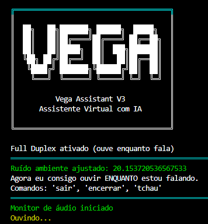

# Vega Assistant




O Vega Assistant é um assistente virtual desenvolvido em Python para desktop, capaz de manter conversas por voz em português utilizando reconhecimento e síntese de fala. O projeto integra modelos de IA via OpenRouter, consulta informações de clima e horário em tempo real e implementa um modo **Full Duplex**, permitindo que o usuário interrompa o assistente durante a fala para tornar a interação mais natural.

## 🌐 Ecossistema Vega

O projeto Vega está disponível em duas versões, cada uma desenvolvida para uma experiência diferente de utilização.

| Projeto | Descrição | Tecnologias |
|---------|-----------|-------------|
| 🤖 **Vega Assistant (Desktop)** | Assistente virtual desenvolvido em Python com reconhecimento e síntese de voz, IA via OpenRouter, modo Full Duplex e consultas de clima e horário. | Python • SpeechRecognition • pyttsx3 • OpenRouter |
| 🌐 **[Vega Assistant Web](https://github.com/Marcus-Jr/vega-assistant-web)** | Versão web do assistente com interface moderna, esfera 3D interativa e suporte à Web Speech API. | Flask • JavaScript • Three.js • OpenRouter |

## 🚀 Começando

Estas instruções permitirão executar uma cópia do projeto em sua máquina local para desenvolvimento e testes.

Consulte [Implantação](#-implantação) para informações sobre execução em outros ambientes.

## 📋 Pré-requisitos

- **Python 3.11+**
- **pip**
- Microfone conectado ao computador
- Alto-falantes ou fones de ouvido
- Uma chave de API da OpenRouter (https://openrouter.ai)

Verifique a instalação:

```bash
python --version
pip --version
```

## 🔧 Instalação

Clone o repositório:

```bash
git clone https://github.com/Marcus-Jr/vega-assistant.git
cd vega-assistant
```

Crie um ambiente virtual:

```bash
python -m venv .venv
```

Ative o ambiente:

**Windows**

```bash
.venv\Scripts\activate
```

**Linux/macOS**

```bash
source .venv/bin/activate
```

Instale as dependências:

```bash
pip install -r requirements.txt
```

Crie um arquivo `.env` na raiz do projeto:

```env
OPENROUTER_API_KEY=sua_chave_aqui
OPENROUTER_MODEL=nemotron-3-ultra-550b-a55b:free
DEFAULT_CITY=São Paulo
```

Execute o assistente:

```bash
python main.py
```

Após iniciar, basta falar com o Vega através do microfone.

## ⚙️ Executando os testes

Atualmente o projeto não possui testes automatizados.

A validação pode ser feita executando a aplicação e verificando o funcionamento dos principais recursos.

## 🔩 Analise os testes de ponta a ponta

Recomenda-se validar:

- Inicialização do assistente
- Reconhecimento de voz
- Respostas utilizando IA
- Interrupção da fala (Full Duplex)
- Consulta de horário
- Consulta de clima atual
- Consulta de previsão do tempo

Exemplos:

```
Que horas são?

Como está o tempo em Curitiba?

Vai chover amanhã em Joinville?

Conte uma curiosidade sobre astronomia.
```

## ⌨️ E testes de estilo de codificação

O projeto ainda não possui um linter configurado.

Recomenda-se seguir as convenções da **PEP 8**.

Para validação:

```bash
pip install flake8
flake8 .
```

## 📦 Implantação

O Vega Assistant foi desenvolvido como uma aplicação desktop em Python e pode ser executado em qualquer ambiente que possua:

- Python instalado
- Dependências do projeto
- Microfone configurado
- Variáveis de ambiente corretamente definidas

Para distribuição, recomenda-se utilizar ferramentas como:

- PyInstaller
- auto-py-to-exe

## 🛠️ Construído com

- [Python](https://www.python.org/) - Linguagem principal do projeto
- [OpenRouter](https://openrouter.ai/) - Gateway para acesso aos modelos de IA
- [SpeechRecognition](https://pypi.org/project/SpeechRecognition/) - Reconhecimento de voz
- [pyttsx3](https://pyttsx3.readthedocs.io/) - Síntese de voz offline
- [PyAudio](https://people.csail.mit.edu/hubert/pyaudio/) - Captura de áudio do microfone
- [Pygame](https://www.pygame.org/) - Reprodução e gerenciamento de áudio
- [Open-Meteo](https://open-meteo.com/) - Consulta de clima e previsão do tempo
- [NumPy](https://numpy.org/) - Processamento de sinais de áudio
- [python-dotenv](https://pypi.org/project/python-dotenv/) - Gerenciamento das variáveis de ambiente

## ✨ Funcionalidades

- Conversação por voz em português
- Reconhecimento automático de comandos
- Respostas utilizando IA via OpenRouter
- Modo Full Duplex (ouve enquanto responde)
- Interrupção da fala em tempo real
- Consulta de horário
- Consulta de clima e previsão do tempo
- Configuração simples através de arquivo `.env`

## 📌 Versão

3.0 (Desktop)

## ✒️ Autor

- **Marcus-Jr** - Desenvolvimento inicial - https://github.com/Marcus-Jr

---

Feito por [Marcus-Jr](https://github.com/Marcus-Jr) 😊
